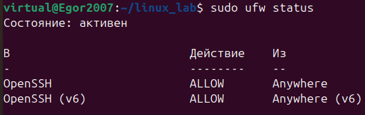
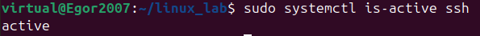
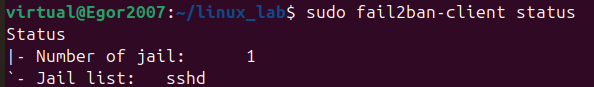
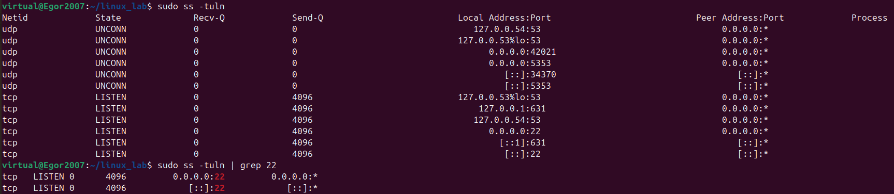

# Настройка защищённого Linux-сервера

## Цель проекта
Развернуть и защитить Linux-сервер (Ubuntu, VirtualBox) с базовыми 
мерами по информационной безопасности: SSH-доступ, firewall, защита 
от брутфорса.

## Технологии
Ubuntu Server, OpenSSH, UFW, Fail2ban

## Что сделано
- Установлен и настроен SSH-доступ
- Настроен firewall (UFW)
- Установлен и настроен fail2ban для защиты от подбора паролей

## Скриншоты проверки

## Как воспроизвести
Полный список команд — в [commands.md](./commands.md)

## Что можно улучшить
- Перевести SSH на нестандартный порт (2222)
- Запретить прямой вход root (PermitRootLogin no)
- Ужесточить правила fail2ban (уменьшить лимит попыток входа maxretry)
